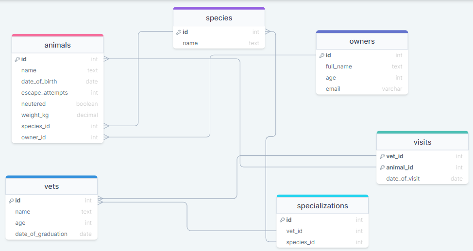

# Vet Clinic DataBase

> This is a project that contains a database for a vetclinic to store information about some weird type of pets
- Check out the diagram:


## Built With

- PostgreSQL

## Getting Started

This repository includes files with plain SQL that can be used to recreate a database:

- Use [schema.sql](./schema.sql) to create all tables.
- Use [data.sql](./data.sql) to populate tables with sample data.
- Check [queries.sql](./queries.sql) for examples of queries that can be run on a newly created database. **Important note: this file might include queries that make changes in the database (e.g., remove records). Use them responsibly!**

### Setup

Follow these steps on your console to properly clone this repository on your desktop:

```
$ git clone 'repo_path'
$ cd 'repo_name'
$ code .
```

## Authors

👤 **Ulises Largaespada**

- GitHub: [@ulisesedu7](https://github.com/ulisesedu7)
- Twitter: [@LongswordMusic](https://twitter.com/LongswordMusic)
- LinkedIn: [Ulises Largaespada](https://www.linkedin.com/in/ulises-largaespada-45570b1a4/)

👤 **David Verde**
- GitHub: [@omarramoun](https://github.com/David-Verde)
- Twitter: [@omarramoun](https://twitter.com/UnyieldingOne)
- LinkedIn: [david-verde-alvarez](https://www.linkedin.com/in/david-verde-alvarez/)

## 🤝 Contributing

Contributions, issues, and feature requests are welcome!

Feel free to check the [issues page](../../issues/).

## Show your support

Give a ⭐️ if you like this project!

## Acknowledgments

- Hat tip to anyone whose code was used
- Microverse
- My supportive family 😊

## 📝 License

This project is [MIT](./MIT.md) licensed.
